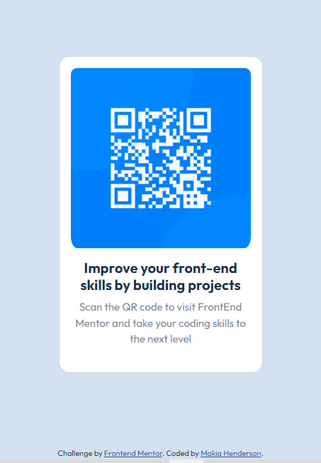

# Frontend Mentor - QR code component solution

This is a solution to the [QR code component challenge on Frontend Mentor](https://www.frontendmentor.io/challenges/qr-code-component-iux_sIO_H). Frontend Mentor challenges help you improve your coding skills by building realistic projects. 

## Table of contents

- [Overview](#overview)
  - [Screenshot](#screenshot)
  - [Links](#links)
- [My process](#my-process)
  - [Built with](#built-with)
  - [What I learned](#what-i-learned)
  - [Continued development](#continued-development)
  - [Useful resources](#useful-resources)
- [Author](#author)

**Note: Delete this note and update the table of contents based on what sections you keep.**

## Overview

### Screenshot



### Links

- Solution URL: [GitHub Repo](https://github.com/Makia98/QRCodeComponent.git)
- Live Site URL: {Live site URL](https://makia98.github.io/QRCodeComponent/)

## My process

### Built with

- Semantic HTML5 markup
- CSS custom properties
- Flexbox
- Mobile-first workflow
- [Bootstrap](https://getbootstrap.com/) - CSS Framework

### What I learned

I was finally able to figure out how to further manipulate images within Bootstrap cards. For example I figured out how to add the correct amount of padding around the image and utilized the border radius property for rounded corners to make it look more like the desired design. 
To see how you can add code snippets, see below:

```css
img {
  padding: 6px 16px 8px 16px; 
  border-radius: 25px;
}

```
### Continued development

I'd love to dive even further into how to customize Bootstrap as well as practicing the CSS Box Model for styling.

### Useful resources

- [Boostrap](https://getbootstrap.com/docs/5.2/components/card/) - This was the foundation of my project and made building the card component very easy. The documentation is a wonderful resource on how to build the card.
- [MDN](https://developer.mozilla.org/en-US/docs/Web/CSS/padding) - MDN is of course my go to resource for all things HTML and CSS. Specifically I used this resource when trying to remember the padding syntax.
[Outfit](https://fonts.google.com/specimen/Outfit) - Google Fonts was used and will be for many projects if not all.

## Author
- Frontend Mentor - [@Makia98](https://www.frontendmentor.io/profile/Makia98)

